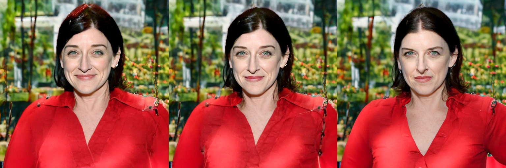
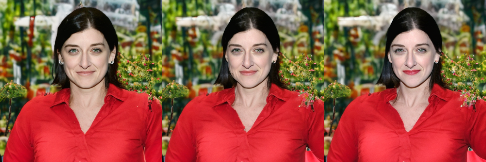
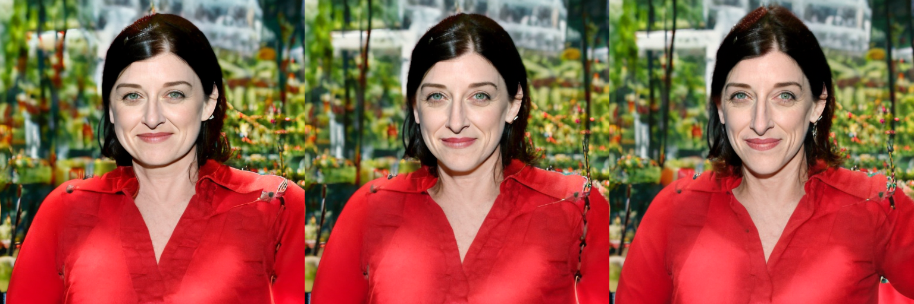
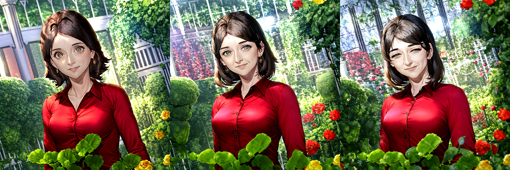
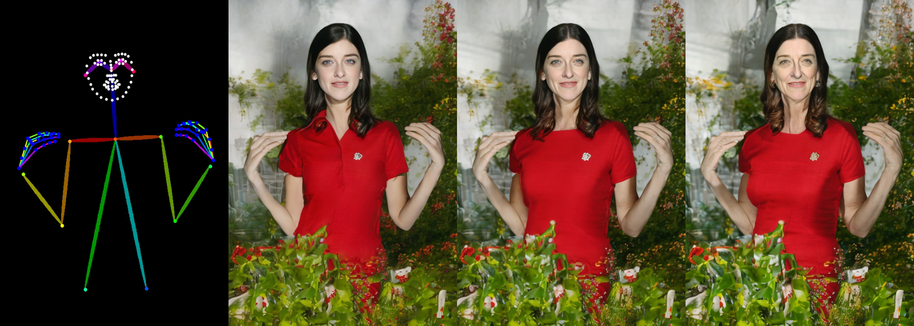

<div align="center">
<h1>When StyleGAN Meets Stable Diffusion:<br> a ${\mathcal{W}_+}$ Adapter for Personalized Image Generation</h1>

[Xiaoming Li](https://csxmli2016.github.io/), [Xinyu Hou](https://itsmag11.github.io/), [Chen Change Loy](https://www.mmlab-ntu.com/person/ccloy/)

<div>
    <sup></sup>S-Lab, Nanyang Technological University
</div>

[Paper](https://arxiv.org/pdf/2311.17461.pdf) | [Project Page](https://csxmli2016.github.io/projects/w-plus-adapter/)

<p><B>We propose a</B> $\mathcal{W}_+$ <B>adapter, a method that aligns the face latent space </B> $\mathcal{W}_+$ <B> of StyleGAN with text-to-image diffusion models, achieving high fidelity in identity preservation and semantic editing.</B></p>


<p align="justify">Given a single reference image (thumbnail in the top left), our $\mathcal{W}_+$ adapter not only integrates the identity into the text-to-image generation accurately but also enables modifications of facial attributes along the $\Delta w$ trajectory derived from StyleGAN. The text prompt is ``a woman wearing a spacesuit in a forest''.  </p>

</div>

## TODO
- [x] Release the source code and model.
- [x] Extend to more diffusion models.


## Installation

```
conda create -n wplus python=3.8
conda activate wplus
pip install torch==2.0.1 torchvision==0.15.2 --index-url https://download.pytorch.org/whl/cu118
pip install -r requirements.txt
BASICSR_EXT=True pip install basicsr
```


## Inference
### Step 0: download the weights
> If you encounter errors about StyleGAN that are not easy to solve, you can create a new environment and use a lower torch version, e.g., 1.12.1+cu113. You can refer to installation of our [MARCONet](https://github.com/csxmli2016/MARCONet?tab=readme-ov-file#getting-start)

```
python script/download_weights.py
```


### Step 1: get e4e vector from real-world face images

For in the wild face image: 
```
CUDA_VISIBLE_DEVICES=0 python ./script/ProcessWildImage.py -i ./test_data/in_the_wild -o ./test_data/in_the_wild_Result -n
```

For aligned face image: 
```
CUDA_VISIBLE_DEVICES=0 python ./script/ProcessWildImage.py -i ./test_data/aligned_face -o ./test_data/aligned_face_Result
```

```
# Parameters:
-i: input path
-o: save path
-n: need alignment like FFHQ. This is for in the wild images.
-s: blind super-resolution using PSFRGAN. This is for low quality face images
```

### Step 2: Stable Diffusion Generation Using Our $\mathcal{W}_+$ Adapter.

- The base model supports many pre-trained stable diffusion models, like ```runwayml/stable-diffusion-v1-5```,  ```dreamlike-art/dreamlike-anime-1.0``` and Controlnet, without any training. See the details in the ```test_demo.ipynb```
- You can control the parameter of ```residual_att_scale``` to balance the identity preservation and text alignment.


## Attributes Editing Examples:
```
- Prompt: 'a woman wearing a red shirt in a garden'
- Seed: 23
- e4e_path: ./test_data/e4e/1.pth
```

> Emotion Editing



> Lipstick Editing



> Roundness Editing



> Eye Editing using Animate Model of ```dreamlike-anime-1.0```



> ControlNet using ```control_v11p_sd15_openpose```




## Training
Training Data for Stage 1:
- face image
- e4e vector

```
./train_face.sh
```


Training Data for Stage 2:
- face image
- e4e vector
- background mask
- in-the-wild image
- in-the-wild face mask
- in-the-wild caption

```
./train_wild.sh
```

> For more details, please refer to the ```./train_face.py``` and ```./train_wild.py```

## Others
You can convert the pytorch_model.bin to wplus_adapter.bin by running:
```
python script/transfer_pytorchmodel_to_wplus.py
```


## Failure Case Analyses
Since our $\mathcal{W}_+$ adapter affects the results by using the format of residual cross-attention, the final performance relies on the original results of stable diffusion. If the original result is not good, you can manually adjust the prompt or seed to get a better result.


## License
This project is licensed under <a rel="license" href="https://github.com/csxmli2016/w-plus-adapter/blob/main/LICENSE">NTU S-Lab License 1.0</a>. Redistribution and use should follow this license.


## Acknowledgement
This project is built based on the excellent [IP-Adapter](https://github.com/tencent-ailab/IP-Adapter). We also refer to [StyleRes](https://github.com/hamzapehlivan/StyleRes), [FreeU](https://github.com/ChenyangSi/FreeU) and [PSFRGAN](https://github.com/chaofengc/PSFRGAN).


## Citation

```
@article{li2023w-plus-adapter,
author = {Li, Xiaoming and Hou, Xinyu and Loy, Chen Change},
title = {When StyleGAN Meets Stable Diffusion: a $\mathcal{W}_+$ Adapter for Personalized Image Generation},
journal = {arXiv preprint arXiv: 2311.17461},
year = {2023}
}
```


